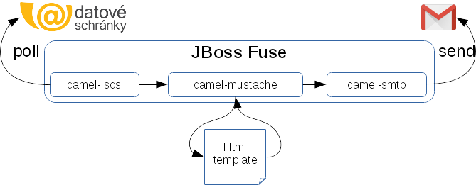

# ISDS Gmail Example
Demo application which simply "forwards" messages from your databox to your Gmail.

It will poll for new messages from "Informační Systém Datových Schránek" (shortcut ISDS)
and send every received message to e-mail address you specify as recipient.



## Getting Access to ISDS
See section [getting access](https://github.com/czgov/camel-isds#getting-access-to-isds)
of underlying [Camel ISDS](https://github.com/czgov/camel-isds) component.

## Building this Application
```bash
git clone https://github.com/czgov/isds-gmail-example.git

cd isds-gmail-example

mvn clean install
```

## Installation on JBoss Fuse
You can download JBoss Fuse from https://developers.redhat.com/products/fuse/overview/

> Currently there is [bug](https://github.com/czgov/java-isds/issues/16)
in underlying library which affects deployment on Apache Karaf 4.x.

1. unzip and start JBoss Fuse 6.3
```bash
cd $FUSE_HOME
bin/fuse
```
2. instal [camel-isds](https://github.com/czgov/camel-isds) component 
```bash
# download features.xml from maven central
JBossFuse:karaf@root> features:addurl mvn:com.github.czgov/camel-isds/0.1.0/xml/features

# download jars and install into Fuse
JBossFuse:karaf@root> features:install camel-isds

# optionally verify features are installed
JBossFuse:karaf@root> features:list | grep isds
[installed  ] [1.1.0                ] isds                                          javaisds-1.1.0                         
[installed  ] [0.1.0-SNAPSHOT       ] camel-isds                                    camel-isds-0.1.0   
```

3. put following configuration into `$FUSE_HOME/etc/isds.mail.cfg`:
```properties
# test for testing/staging environment of isds 
# - this is where you can request test account
# prod 
# - for production environment you need to obtain your PERSONAL data box form Czech POINT or Czech Post
isds.env = test

# your login and password for isds
isds.login = TYPE_YOUR_OWN_LOGIN_HERE
isds.password = TYPE_YOUR_OWN_PASSWORD_HERE

# how often should we pull data? 10s, 3m, 1h ?
isds.delay = 10s

gmail.login = YOU@gmail.com
gmail.recipient = SOMEBODY@gmail.com
gmail.password = YOUR_PASSWORD
```

4. install required camel components
```bash
JBossFuse:karaf@root> features:install camel-mail camel-mustache
```

5. install and start example application fuse
```bash
JBossFuse:karaf@root> osgi:install -s mvn:com.github.czgov/isds-gmail-example/1.0.0-SNAPSHOT
Bundle ID: 298
```


